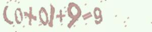
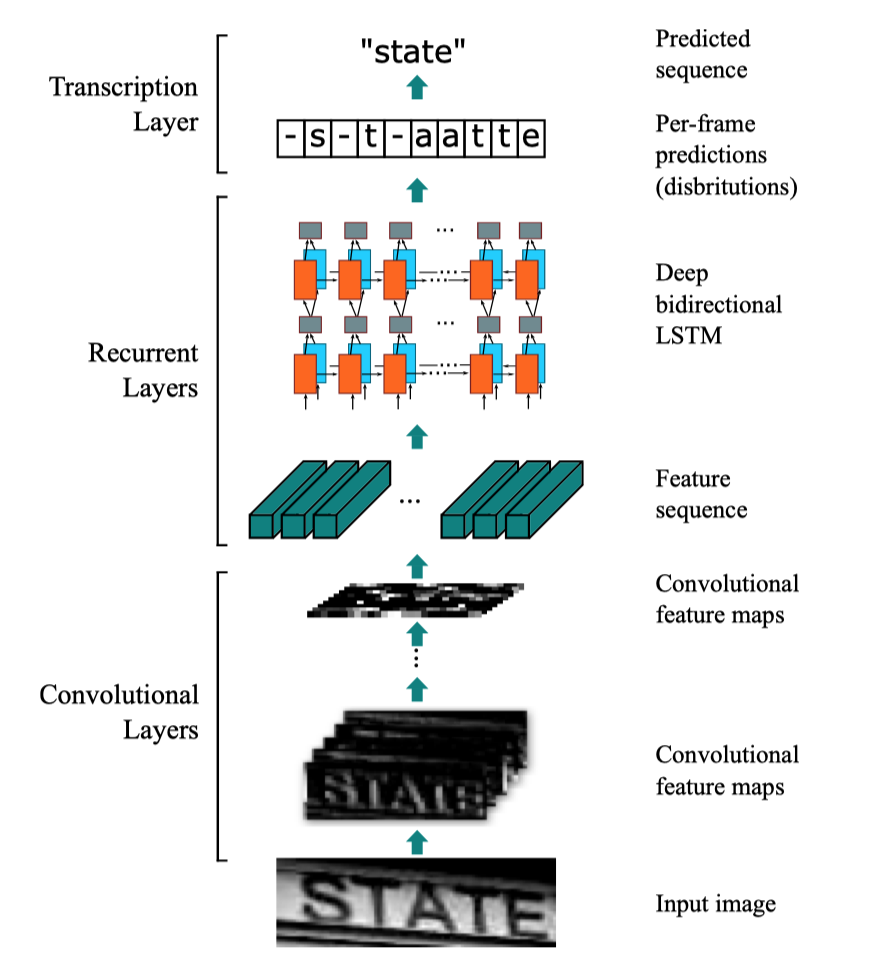

# 机器学习纳米学位开题报告

> ## 算式识别（Mathematical Expression Recognition）

<div style="text-align: right">王新平	2019 年 6 月 8 日</div>

## 项目背景

光学文字识别（Optical Character Recognition，OCR）是计算机视觉领域中长期以来一个重要的研究方向，其应用场景众多，如：纸质资料的电子化、图像中文字提取等。本项要解决的问题是算式识别（Mathematical Expression Recognition），即识别给定图片中的数学式子。

## 数据集和输入

项目使用给定的数据集进行研究，包括图片和标注两部分：

1. 该数据中一共有 10 万张图片，图片中的算式包含 `1，2，3，4，5，6，7，8，9，0，+，-，*，=，（，）` 16 个字符中的部分或全部，所有图片的大小均为 `300x64`，包含 RGB 三个通道，示例图片如下图所示:



2. 与图片相对应的标签，以 csv 文件的形式存储，包含 filename 和 label 两列：

   |  filename   |   label   |
   | :---------: | :-------: |
   | train/0.jpg | (0+0)+9=9 |

## 基准模型

Wang 等人 [1] 首先检测单个字符，然后使用深度卷积神经网络识别检测到的字符，该方案在 IC03 数据集上的准确率达到了 90%；Jaderberg 等人 [2] 将字符识别看作是图像分类问题来处理，为每个英文单词添加一个标签，该方案在 IC03 数据集上的检测准确率达到了 98.7%，在 IC13 数据集上的检测准确率达到了 90.8%；Su and Lu 等人 [3] 使用循环神经网络来解决字符序列识别，首先将输入特征转换为 HOG 特征序列，然后送入循环神经网络进行检测，该方案在 SVT 数据集上的检测准确率为 83.0%，在 IC03 数据集上的检测准确率达到了 92%。本项目的目标是在给定算式识别数据集上的检测准确率超过 99%。

## 评估指标

该问题的预测结果为非数值类型的离散值，可以使用准确率（Accuracy）作为模型性能的评估指标，即**预测结果正确的数量**和**样本总数**的比值：
$$
\operatorname{acc}(f, D)=\frac{1}{m} \sum_{i=1}^{m} b\left(f\left(x_{i}\right), y_{i}\right), x_i \in D
$$
其中，
$$
b(x, y)=\left\{\begin{array}{ll}{1} & {\text { if } x=y} \\ {0} & {\text { if } x \neq y}\end{array}\right.
$$
式 `1` 中 $ D $ 表示整个验证数据集，$ x_i $ 为 $D$ 中的一个样本, $ f(x_i) $ 是预测模型函数，根据输入 $ x_i $ 计算出预测结果，$ y_i $ 是对应样本的真实值，$ b(x, y) $ 将预测结果和真实值进行比较，如果一致则输出 `1`，否则输出`0`。

## 项目设计

项目采用卷积循环神经网络（Convolutional Recurrent Neural Network，CRNN）[4] 模型进行算式识别。CRNN 网络是一个基于图片的字符序列识别模型，支持端到端的训练，其网络结构下图所示：从下到上依次为卷积网络、循环网络和转换网络。



依据上述模型，项目的总体设计如下：

1. **数据预处理**

   由于数据集中所有图像的尺寸均为 `300x64`，不需要对输入图像进行裁剪。但是，输入图像有 `RGB` 三个通道，每个通道中像素的取值范围为 `[0, 255]`，为了便于网络训练，项目将数据集中的图片首先进行灰度处理，然后进行归一化。

   ```mermaid
   graph LR
   A(RGB Image) -->B(Gray Image)
   B --> C(Normalization)
   ```

2. **划分数据集**

   将数据集按照 `8:2` 的比例划分为训练集和测试集，测试集用于最终测试模型的识别效果，同时，为了在训练时对模型进行调优，训练数据集将继续按照 `8:2` 的比例划分为训练集和验证集。

3. **模型实现**

   参考论文 [] 中对 CRNN 网络的描述, 利用 Keras 对 CRNN 网络进行实现。

4. **网络训练**

   CRNN 是一个相对较大的神经网络，对于 卷积网络部分可以使用迁移学习技术，使用预训练的模型对这部分参数进行初始化；除此之外还需要选择合适的学习速率和参数优化算法，对于学习速率，可以利用 TensorBoard 可视化损失函数的变化，从而进行调整。

5. **模型验证**

   在验证数据集上验证模型的识别效果，如果验证效果较差，可以结合交叉验证对网络进行调优。

6. **测试**

   使用上述步骤得到的最佳模型，在测试集上对网络的识别效果进行验证。

## 参考文献

[1] Wang T, Wu D J, Coates A, et al. End-to-end text recognition with convolutional neural networks[C]//Proceedings of the 21st International Conference on Pattern Recognition (ICPR2012). IEEE, 2012: 3304-3308.

[2] Jaderberg M, Simonyan K, Vedaldi A, et al. Reading text in the wild with convolutional neural networks[J]. International Journal of Computer Vision, 2016, 116(1): 1-20.

[3] Su B, Lu S. Accurate scene text recognition based on recurrent neural network[C]//Asian Conference on Computer Vision. Springer, Cham, 2014: 35-48.

[4] Shi B, Bai X, Yao C. An end-to-end trainable neural network for image-based sequence recognition and its application to scene text recognition[J]. IEEE transactions on pattern analysis and machine intelligence, 2016, 39(11): 2298-2304.