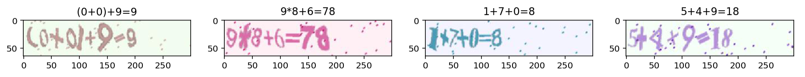
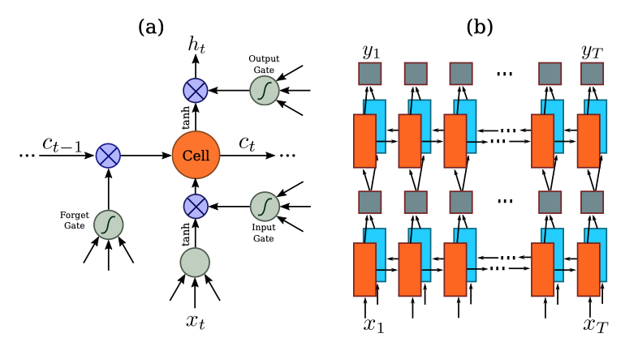
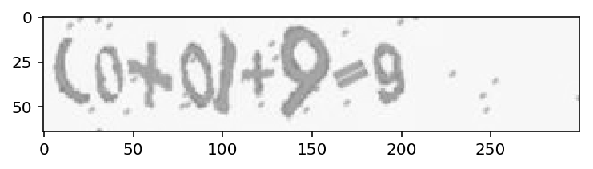
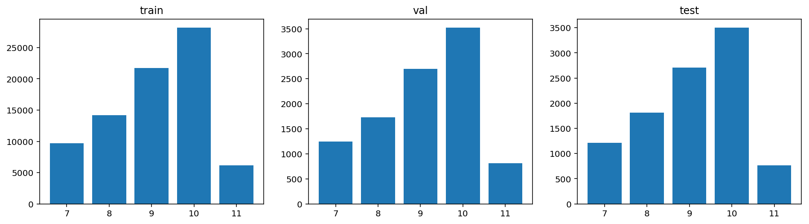
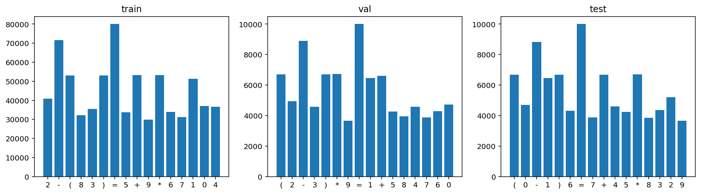
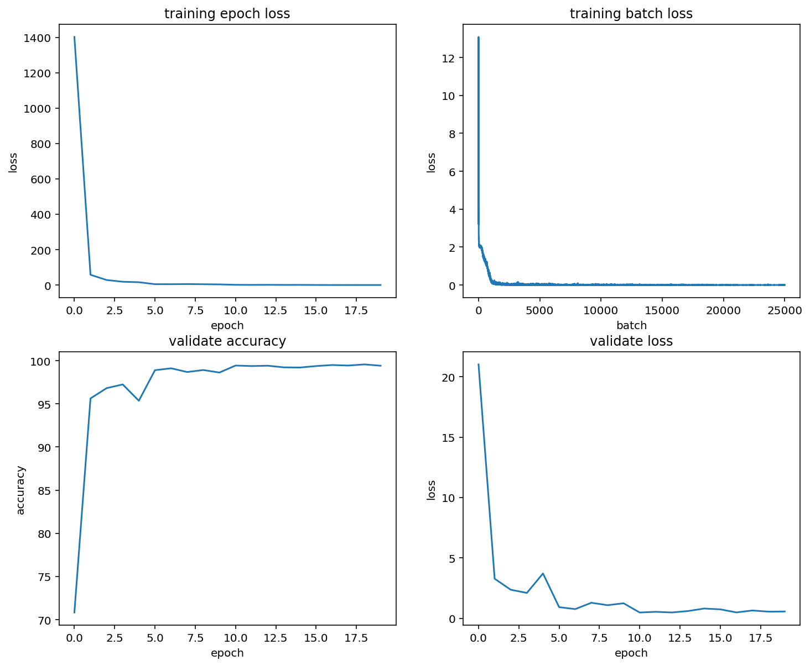
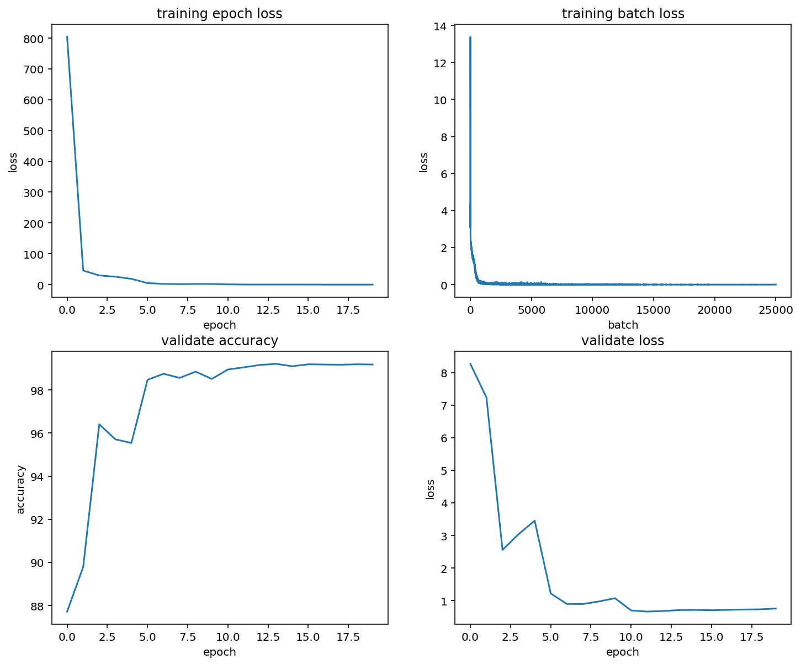
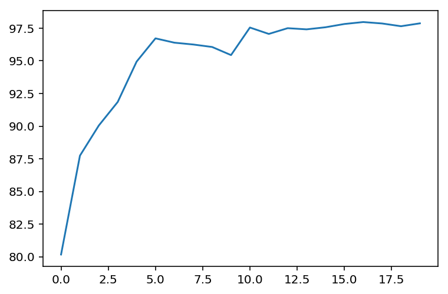
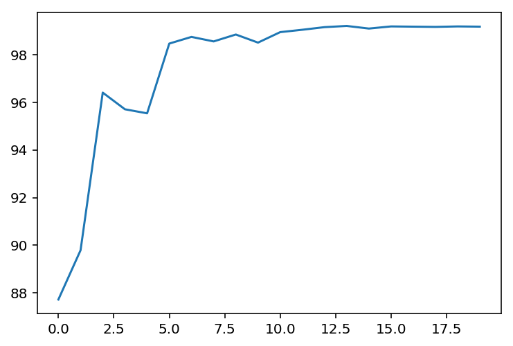

机器学习纳米学位

>  ## 毕业项目

<div style="text-align: right">王新平    2019 年 6 月 26 日</div>
[TOC]

## 1. 问题的定义

### 1.1 项目概述
文字是人类历史上最伟大的发明创造之一，通过文字，人们可以有效记录和传播信息，并且，相比与音频和视频，文字具有更大的便利性。将纸质材料进行电子化，有助于资料的保存和传播；更重要的是，我们已经处于一个智能化的时代，文字不仅仅用来给人看，还要给计算机“看”，让计算机可以直接从图片数据中识别文字，并进行加工处理是重要的应用，例如：Google 翻译可以将图像中的文字在原来的位置转换成用户所熟悉的语言。

本项目的目标是构建一个深度模型来检测图像中算式表达式，该问题属于光学字符识别（Optical Character Recognition，OCR）领域，是计算机视觉领域中长期以来一个重要的研究方向。

### 1.2 问题陈述
与普通的单个字符识别不同，本项目中需要识别的是一个字符序列，即检测图片中的算式表达式。项目将使用深度神经网络来解决这个问题，基本构思如下：

- 使用卷积神经网络提取图像特征：卷积神经网络常用于图像分类和目标检测中，使用卷积神经网络可以从数据中学习特征，并且比传统的基于手工设计特征的算法更具通用性，效果更好。
- 使用循环神经网络进行字符序列预测：循环神经网络被设计来处理时序信息，将字符的特征序列送入循环神经网络来预测字符输出。

基于上述模型构思，项目将给定的数据集划分为训练集、验证集和测试集。在训练集上进行训练，每个迭代后，在验证集上验证模型的检测效果，同时记录最佳模型参数，并最终在测试集上测试模型的检测准确率。

基于课程所学的知识，项目中将分别使用迁移学习和自定义网络两种方法，通过不断优化模型，使模型的检测准确率达到 99% 以上。

### 1.3 评价指标
该问题的预测结果为非数值类型的离散值，可以使用准确率（Accuracy）作为模型性能的评估指标，即**预测结果正确的数量**和**样本总数**的比值：
$$
\operatorname{acc}(f, D)=\frac{1}{m} \sum_{i=1}^{m} b\left(f\left(x_{i}\right), y_{i}\right), x_i \in D
$$
其中，
$$
b(x, y)=\left\{\begin{array}{ll}{1} & {\text { if } x=y} \\ {0} & {\text { if } x \neq y}\end{array}\right.
$$
式 `1` 中 $ D $ 表示整个验证数据集，$ x_i $ 为 $D$ 中的一个样本, $ f(x_i) $ 是预测模型函数，根据输入 $ x_i $ 计算出预测结果，$ y_i $ 是对应样本的真实值，$ b(x, y) $ 将预测结果和真实值进行比较，如果一致则输出 `1`，否则输出`0`。


## 2. 分析
### 2.1 数据的探索
本项目中使用的数据集包含 100,000 组数据，每组数据由一张 `64x300` 的 RGB 图片和对应的标签组成，部分数据如下图所示：



可见，每幅图中包含一个算式，算式中的字符取自「 1, 2, 3, 4, 5, 6, 7, 8, 9, 0, +, -, *, (, ) 」。虽然，图片中的字符基本都存在一定程度的倾斜、粗细也不一致，并且还包括一些噪点，但是，每幅图中字符的颜色都一致，可以明显的从背景颜色中区分出来。

### 2.2 探索性可视化
由于标签会影响到模型中一些参数的设计，这里对数据集中标签的长度和每个字符出现的次数进行统计分析。

(1) **标签长度**

标签的长度分布如下图所示，从图中可见：标签的长度分布在 7-11 之间，并且极不均匀，长度为 10 的标签数量最多，是长度为 11 的标签数量的 4 倍多。


(2) **字符统计**

标签中出现的字符数一共 16 个，`=` 出现的次数最多，这是因为每个算式中都存在等号，其他字符可以分为**运算符**和**数字**两类中，运算符中 `(, ), +, *` 出现的次数基本一致，`-` 出现的次数相对较高，而数字中，除 `1` 出现的次数略高外，其他数字出现的次数也相对比较均匀。


### 2.3 算法和技术

2.3.1 **算法**

本项目使用 Baoguang Shi[1] 等人设计的卷积循环神经网络检测图像中的算式，该网络由卷积网络、循环网络和转译网络三部分组成：卷积网络用于提取图像特征，循环网络根据图像特征预测图像中的字符，最后的转译网络根据循环网络的输出翻译成算式表达式。

(1) **卷积神经网络**

卷积神经网络是含有卷积层的神经网络，通常还包含池化层。卷积网络常用于目标检测和图像分类，相较于传统的手工设计特征，卷积神经网络使用随机初始话的卷积核，在大量数据上进行训练，可以学习到检测各种特征的卷积核，并且检测效果也有极大的提升。

a. 卷积

不同于数学意义上的卷积运算，卷积神经网络中使用的是互相关运算。计算方法如下图所示，将卷积核从输入的最左上方开始，按从左到右，从上到下的顺序，依次在输入矩阵上滑动，在滑动中的每个位置上，将输入矩阵和卷积核的对应元素相乘并求和，得到输出矩阵对应位置的值。


在卷积网络中除了第一层的输入可能只有一个通道外，其他层的输入都包含多个通道，多通道输入的卷积计算如下图所示。


b. 池化

池化层的计算与卷积计算的过程相似，同样要使用是一个窗口在输入矩阵上滑动，不同的是，这里的输出是窗口内元素的最大值或平均值。经过池化操作，可以减小输入下一层网络的数据的规模，同时，可以有效缓解卷积层对位置的敏感性。


(2) **循环神经网络**

循环神经网络被设计用来处理时序信息，它引入状态变量来存储过去的信息，并与当前的输入共同决定当前的输出。CRNN 中使用的循环网络是长短期记忆网络（Long Short-Term Memory，LTSM）。LTSM 引入了三个门：输入门、遗忘门和输出门，以及与隐藏状态形状相同的记忆细胞，从而记录额外信息，其网络单元和网络结构如下图所示。



(3) **CTC 损失函数**

通常在处理语音或字符识别这类时序信息时，存在一个对齐问题。RNN 的输出是一个固定长度的序列，需要将序列中的每个字符和输入图像中的每个相应字符对其，才能得到准确的预测输出。CTC（Connectionist Temporal Classification）有效解决了这个问题，它尝试将预测输出进行各种组合，再计算所有组合的联合概率。使用 CTC 损失函数，可以实现 CRNN 网络的端到端训练。
$$
p(Y | X)=\sum_{\mathcal{A} \in \mathcal{A}_{X, Y}} \prod_{t=1}^{T} p_{t}\left(a_{t} | X\right), \operatorname{Loss}(D)=\sum_{(X, Y) \in D}-\log p(Y | X)
$$
式中，$ X $ 和 $ Y $ 分别为输入和标签，$ T $ 为时间序列的长度，$ p_{t}\left(a_{t} | X\right) $ 表示在给定输入 X 的情况下索引 $ t $ 位置的字符是 $ a_{t} $ 的概率，$ \mathcal{A}_{\mathcal{X}, \mathcal{Y}} $ 是给定标签下，所有可能的字符组合。

2.3.2 **技术**

本项目使用 PyToch 进行模型实现，PyToch 是主导 Facebook 主导的一个优秀的深度学习平台，其提供了极大的灵活性和速度，而没有引入过多额外的概念。

### 2.4 基准模型

Wang 等人 [2] 首先检测单个字符，然后使用深度卷积神经网络识别检测到的字符，该方案在 IC03 数据集上的准确率达到了 90%；Jaderberg 等人 [3] 将字符识别看作是图像分类问题来处理，为每个英文单词添加一个标签，该方案在 IC03 数据集上的检测准确率达到了 98.7%，在 IC13 数据集上的检测准确率达到了 90.8%；Su and Lu 等人 [4] 使用循环神经网络来解决字符序列识别，首先将输入特征转换为 HOG 特征序列，然后送入循环神经网络进行检测，该方案在 SVT 数据集上的检测准确率为 83.0%，在 IC03 数据集上的检测准确率达到了 92%。本项目的目标是在给定算式识别数据集上的检测准确率超过 99%。


## 3. 方法
### 3.1 数据预处理
从数据集中读取到的图像数据是包含 RGB 三个颜色通道，并且每个通道的颜色值都在 [0-255] 之间，这里将输入图片转化为灰度图，并进行了标准化处理。这些操作在 PyTorch 中可以方便的通过 Tansform 组合来完成。而标签在前向传播中并不参与计算，只有在计算 CTC 损失的时候才会用到，并且计算 CTC 损失的时候需要将批量中的标签放到统一长度的数组中，并标注其真实长度，所以暂时不做处理。



### 3.2 执行过程
本项目模型的训练在 Google CoLab 平台上进行，该平台提供了免费的机器学习环境，支持 GPU 加速。其基本配置如下：

- Intel Xeon 单核双线程处理器，主频 2.300GHz
- NVIDIA Tesla K80 显卡
- 12.7 G 内存，358G 硬盘存储空间
- Ubuntu 18.04.2 操作系统

3.2.1 数据集划分

将数据集中的数据按照 8:1:1 的比例划分为训练集、验证集和测试集。训练过程中，在训练数据集上计算损失并优化网络的参数，然后在验证集上验证模型的检测准确率，并将准确率最高时模型的参数保存到文件中。训练完成后，用在验证集上表现最佳模型参数在测试集上进行测试。

为了保证数据集划分后数据分布没有明显的偏差，对三个数据集中标签的长度和字符进行了统计，结果如下图所示。





3.2.2 模型定义

本项目将分别尝试了基于 VGG 的迁移学习和自定义模型，为了使得 CRNN 网络具有一定的通用型，将 CNN 网络作为模型定义中的一个参数。


```python
class ConvRecNet(nn.Module):
  # cnn_feature_len: (channels x height) of cnn
  def __init__(self, cnn, cnn_feature_len, class_size):
    super(ConvRecNet, self).__init__()
    self.cnn = cnn
    self.rnn = BidirectionalLSTM(cnn_feature_len, 2)
    self.trans = TransNet(2 * cnn_feature_len, class_size)
	def forward(self, input):
    conv_out = self.cnn(input)
    b, c, h, w = conv_out.size()
    # 最终输入 rnn 网络的是 (w, b, h * c), 先将 w 和 b 移到最前面，
    # 再将最后两个维度合并
    conv_out = conv_out.permute(3, 0, 2, 1)
    conv_out = conv_out.reshape(w, b, -1)
    rnn_out = self.rnn(conv_out)
    trans_out = self.trans(rnn_out)
    return trans_out
```
由 CRNN 网络预测输出的算式中包含重复字符和空字符，需要进行解码将这些字符去除，例如：`5*(22+2))=======2 0` 解码后为 `5*(2+2)=20`。

```python
def decode_ctc(ctc_indexes, blank_index=0):
    filtered_ctc_indexes = []
    for i, x in enumerate(ctc_indexes):
        if x !=  blank_index:
            if i == 0:
                filtered_ctc_indexes.append(x)
            elif x != ctc_indexes[i - 1]:
                filtered_ctc_indexes.append(x)
    
    return indexes_to_label(filtered_ctc_indexes)
```

3.2.2 VGG（迁移学习）

(1) **模型修改**

PyTorch 的 `torchvision.models` 模块中提供了 VGG、ResNet 等多种预训练经典的卷积神经网络模型，一行代码就可以实现这些模型的加载。

```python
from torchvision import models
vgg16 = models.vgg16(pretrained=True)
```

加载模型后还需要对模型进行一些调整，以适应上面的 RCNN 网络定义和数据集中的数据。

- 原数据集中的图像经过预处理后已经转换为灰度图，只有一个颜色通道，因此需要调整 `vgg16` 网络的输入层
- `vgg16` 除卷积层外，还有一个池化层和分类层，这两层需要从模型中去除
- 将数据集中的图片经过 `vgg16` 的卷积部分处理后，输出的维度为 `(512, 2，8)` 这一位着经过后面的 `RNN` 网络处理后只能输出长度为 `8` 的序列，需要对最后的池化层也进行调整。

除上述几点必要的调整外，还对卷积网络的输出增加了 `BatchNorm` 处理，以提高网络优化的速度和模型预测的准确率（进实验，如果不加 `BatchNorm`，网络收敛的速度大大降低）

```python
my_vgg_conv_list = [nn.Conv2d(in_channels=1, out_channels=64, kernel_size=3, padding=1)]
my_vgg_conv_list.extend(list(vgg16.features)[1:30])
my_vgg_conv_list.append(nn.MaxPool2d((2, 1)))
# 添加 BatchNorm，如果没有该处理，网络训练的时候无法收敛
my_vgg_conv_list.append(nn.BatchNorm2d(512))
my_vgg = nn.Sequential(*my_vgg_conv_list)
```

(2) **模型训练**

项目使用 `Adam` 模型参数优化方法对模型进行优化，同时还结合了 `lr_scheduler` 来调节学习速率，使得在训练的早期网络的性能可以快速提升，同时，在训练的后期，不至于由于学习速率过大，导致预测准确率有过大的波动，网络性能无法改善。

```python
import torch.optim as optim
from torch.optim import lr_scheduler

# Adam 的优化提升速度远快于 SGD
# optimizer = optim.SGD(net.parameters(), 0.005, momentum=0.9)
optimizer = optim.Adam(my_vgg_rnn.parameters(), lr=0.002)
# Decay LR by a factor of 0.5 every 5 epochs
exp_lr_scheduler = lr_scheduler.StepLR(optimizer, step_size=5, gamma=0.5)

train_result = train_model(my_vgg_rnn, criterion, optimizer, exp_lr_scheduler, 20, 'my_vgg_rnn.pth')
```

经过 3 个多小时的训练，模型达到在验证集上的准确率达到 99.57%，下图是在训练过程中记录的损失和预测准确率的变化。



(3) **模型测试**

加载训练过程中再验证数据集上表现最佳的模型，在测试数据集上测试结果。

```python
# 加载最优模型参数
my_vgg_rnn.load_state_dict(torch.load('my_vgg_rnn.pth'))
# 在测试数据集上进行验证
validate_result_on_test_dataset = validate(my_vgg_rnn, data_loaders['test'])
print("predict accuracy on test dataset: {}%".format(validate_result_on_test_dataset['acc_rate']))
print("predict loss on test dataset: {}".format(validate_result_on_test_dataset['loss']))
```

测试结果显示，模型的预测准确率为 99.48%，超过了预设的目标。

3.2.3 自定义模型

(1) **模型设计**

`VGG16` 网络中的参数众多，需要较长的时间进行训练（6个多小时），保存的模型参数文件超过 220 M。这里将定义一个较为简单的网络，每层的输入与输出维度如下表所示。

| layer           | input         | output        |
| --------------- | ------------- | ------------- |
| conv(3x3)       | (1, 64, 300)  | (32, 64, 300) |
| max_pool(2x2)   | (32, 64, 300) | (32, 32, 150) |
| conv(3x3)       | (32, 32, 150) | (64, 32, 150) |
| max_pool(2x2)   | (64, 32, 150) | (64, 16, 75)  |
| conv(3x3)       | (64, 16, 75)  | (128, 16, 75) |
| max_pool(2x2)   | (128, 16, 75) | (128, 8, 38)  |
| conv(3x3)       | (128, 8, 38)  | (256, 8, 38)  |
| conv(3x3)       | (256, 8, 38)  | (256, 8, 38)  |
| max_pool(2x2)   | (256, 8, 38)  | (256, 4, 19)  |
| batch_norm(256) | (256, 4, 19)  | (256, 4, 19)  |
| conv(3x3)       | (256, 4, 19)  | (512, 4, 19)  |
| conv(3x3)       | (512, 4, 19)  | (512, 4, 19)  |
| conv(3x3)       | (512, 4, 19)  | (512, 4, 19)  |
| max_pool(2x1)   | (512, 4, 19)  | (512, 2, 19)  |
| batch_norm(512) | (512, 2, 19)  | (512, 2, 19)  |

(2) **模型训练**

自定义模型的训练和迁移学习的训练过程一致，同样使用了 `Adam` 和  `lr_scheduler` ，相比于 VGG16，自定义网络的参数更少，训练速度也更快，仅 85 分钟就完成了训练。

 

(3) **模型测试**

自定义模型在验证数据集上的最佳表现为 99.21%，对应参数在测试集上的预测准确率为 99.13%

### 3.3 完善
3.3.1 **迁移学习**

在使用迁移学习之前，项目还尝试了自定义 `VGG16` 模型，从随机初始参数开始训练。在训练过程中，在训练集上的预测损失稍微下降一点后就开始波动，在验证集上的预测正确率始终为 0，网络无法收敛。参考论文后，在原卷积网络的最后一层后面增加了 `BatchNorm` 操作，此后，网络可以正常训练，通过不断的调整学习速率 [0.005, 0.001, 0.0005, 0.0002]，最终检测准确率可以达到 98.42%（虽然这个结果与设定的目标还有一点差距）。所以，在最终使用迁移学习时，直接在卷积网络的最后增加了 `BatchNorm`，整个训练过程也比较顺利，最终训练结果在验证数据集上的预测准确率可以达到 99.57%，在测试数据集上的预测结果为 99.48%

3.3.2 **自定义模型**

自定义的初始模型为类似 LeNet 的卷积层和池化层交替：6 个卷积层和 6 个池化层，最后加一个 `BatchNorm`。但是，通过多次学习速率调节，其最佳预测准确率在 97% 左右，参考 VGG 网络的设计，尝试增加卷积层的深度，并增大学习速率的衰减速度，训练得到最终模型。下图是初始模型和最终模型在训练迭代过程中在验证数据集上的预测准确率变化。



<center>初始模型</center>



<center>最终模型</center>


## 4. 结果
### 4.1 模型的评价与验证
(1) 自定义模型的最终预测准确率为 99.13%，与利用迁移学习得到的使用 vgg16 作为卷积层的模型（99.48%）相比要低 0.35%。但是，相应的模型中的参数减少了 13%，所需的训练时间降低了 56%。

(2) 对比在验证集和测试集上的准确率，可以看到，两者几乎一致，说明网络没有过拟合。为了测试模型的通用性，还在一些原数据集之外的图片上进行测试，下面是测试结果。


从上面的测试结果可以看到，在自定义数据上，模型的预测预测结果全部错误，图 1-3 中虽然最终结果错误，但是大部分字符的预测结果都还是正确的，而图 4 是一张银行卡的一部分，该图片中没有运算符，只有数字，显然预测结果与图片内容相差甚远。而在原数据集中的数据上表现良好，这说明网络的适用性存在一定的局限性，但是针对特定的数据集仍能有效解决问题。

### 4.2 合理性分析
由训练过程中的损失曲线和在验证集上的预测正确率可以看到，最终模型验证集上的预测准确率最终超过了 99%， 达到 99.21%，相应的在测试数据集上的的预测准确率也达到了 99.13%，都超过了基准模型。

从上面的评价与验证中，可以看到，模型在非数据集中数据上的表现较差，这是因为原网络中的特征是从数据集中的数据上学习到的，所以手写数字或者换用其他字体的数字后，预测结果较差；另外，循环神经网络用来处理卷积网络运算后的图像特征，第 4 幅图中仅有数字，但是预测的结果中存在 `*` 和 `=` 两种运算符，说明网络预测的方向就是算式。

 综上所述，最终模型在给定的数据集上超过了基准模型，有效解决了给定的问题。


## 5. 项目结论
### 5.1 结果可视化
项⽬的目标是在给定数据集上的预测准确率超过 99%，基于迁移学习的 VGG16 和自定义模型都实现了预定目标，下表是这种方法的对比：

| 模型       | 准确率           | 训练时间 | 参数文件大小 |
| ---------- | ---------------- | -------- | ------------ |
| 迁移学习   | 99.48%（99.57%） | 194min   | 216M         |
| 自定义模型 | 99.13%（99.21%） | 84min    | 187M         |


### 5.2 对项目的思考
(1) 数据探索部分可知数据集中标签的长度和字符的出现频率分布都不均匀，但是，随机划分数据集后，各部分的分布几乎一致，这在一定程度上避免了数据不均导致的问题。

(2) BatchNorm 是深度神经网络的一个重要部分，其可以有效调整数据的分布，进而加快网络的训练速度，提升模型检测的准确率。在项目初期，曾尝试过自定义VGG 模型，从随机初始化参数开始训练，但是整个训练损失在略有下降之后就开始徘徊，增加了 BatchNorm 之后，模型的损失可以快速下降。

(3) 动态学习速率有利于模型的训练，在模型训练的初期，较大的学习速率可以快速提升模型的准确率，但是，在几个迭代过程之后，模型就开始出现波动，出现预测准确率下降的问题，这时，需要一个更小的学习速率来训练网络。


### 5.3 需要作出的改进
(1) 模型优化：

- 项目中使用的数据集相对较小，图片中的算式虽然存在一些倾斜或颜色上的变化，总体上来说还是比较统一，所以，在该数据集上表现好的模型，切换了数据之后表现就较差。所以，在一个更为形式多样的数据集上训练的模型可能泛化效果会更好
- 项目将预测结果解码的时候会将连续的重复字符去掉，所以，项目中定义的模型也无法预测存在连续字符的算式，例如: `11*2=22`，即使 RNN 网络输出的结果正确，解码之后也会变成  `1*2=2`。

(2) 开发流程：

使用 Jupyter 进行开发，可以随时运行部分代码来查看结果，但是，在补全和语法检查方面，相比于 IDE 还是要差一些，这使得一些问题只有在运行的时候才会发现，并且调试也不是很方便，经常需要 print 一些东西。

------

参考资料：

[1] Shi B, Bai X, Yao C. An end-to-end trainable neural network for image-based sequence recognition and its application to scene text recognition[J]. IEEE transactions on pattern analysis and machine intelligence, 2016, 39(11): 2298-2304.

[2] Wang T, Wu D J, Coates A, et al. End-to-end text recognition with convolutional neural networks[C]//Proceedings of the 21st International Conference on Pattern Recognition (ICPR2012). IEEE, 2012: 3304-3308.

[3] Jaderberg M, Simonyan K, Vedaldi A, et al. Reading text in the wild with convolutional neural networks[J]. International Journal of Computer Vision, 2016, 116(1): 1-20.

[4] Su B, Lu S. Accurate scene text recognition based on recurrent neural network[C]//Asian Conference on Computer Vision. Springer, Cham, 2014: 35-48.

[5] https://pytorch.org/tutorials/beginner/data_loading_tutorial.html

[6] https://pytorch.org/tutorials/beginner/transfer_learning_tutorial.html

[7] Aston Z, Zachary C, Mu L, et al. 动手学深度学习[B], 2019.

